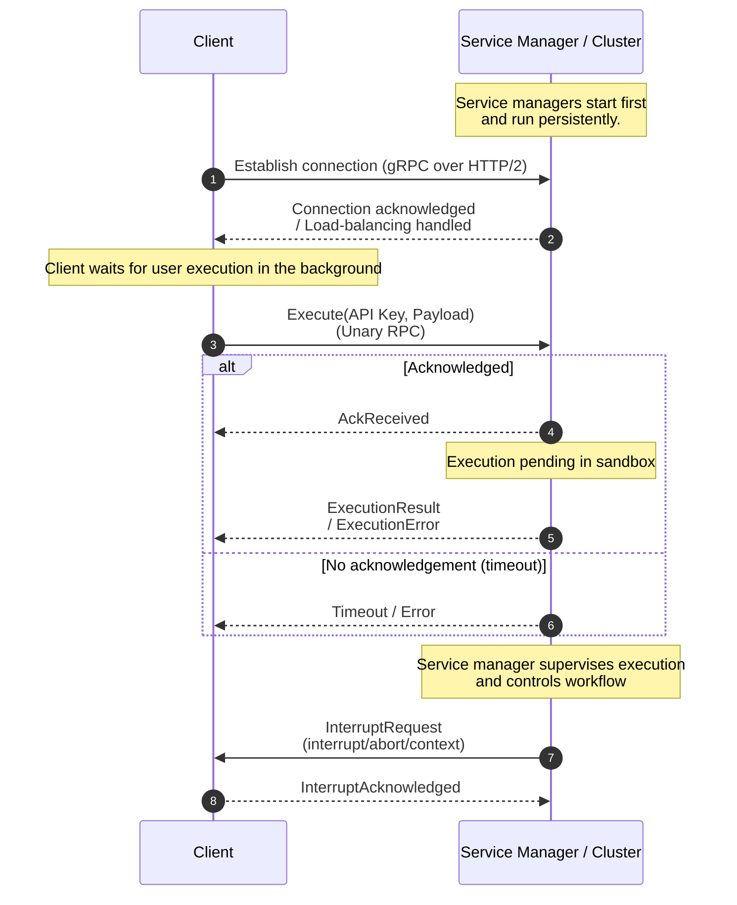
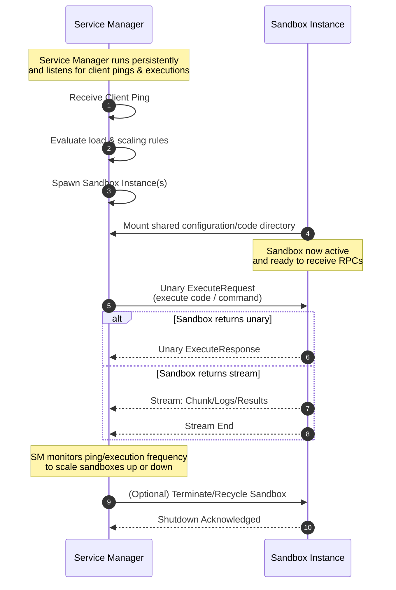
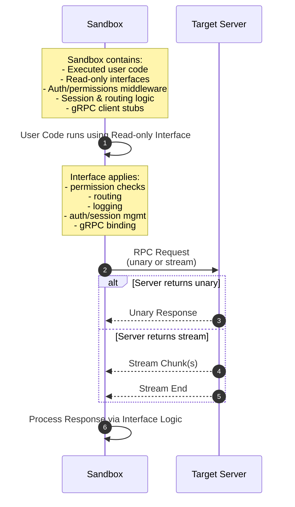

# Life Cycle

Each component link within the model control interface maintains its own
independent connection life cycle, with different mechanisms such as
authentication, authorization, validation, or state tracking depending on the
layer and the requirements of the specific connection.
To explain the life cycle of every interaction we will look at each connection
independently.

## Client - Service Manager

The client is a standalone component that can operate independently, but it
must establish a connection to one or more service managers in order to execute
actions.
A service manager is a persistent server responsible for managing services, the
sandbox environment, and supervising code execution initiated by the client.
A client may connect to a single service manager or a cluster of them.
The connection between the client and the service manager(s) is established
using gRPC over HTTP/2, providing built-in support for load balancing and
efficient bidirectional communication.

1. In the beginning, the service manager(s) operate as the only active entities
   in the network.
2. When the client wants to execute some code, it sends a unary RPC to the
   service manager with the given API key.
3. Service manager evaluates the request:
   - **If** the request is acknowledged by the service manager:
     - It awaits execution.
     - Later, it returns the execution response or an error if the execution
       failed.
   - **Else** the RPC times out and The client is informed of the timeout.
4. The service manager could also send RPCs to the client application to
   interrupt the client's activity.

## Service Manager - Sandbox

Although the service manager and the sandbox are not exactly independent
entities, they still have a connection life cycle.

1. When the service manager receives a new connection ping from a client, it
   spins up a sandbox. This sandbox could be Docker container(s), Nix servers,
   a service like Daytona, or even the local machine. The service manager also
   listens for pings and executions, and uses their frequency to determine the
   number of sandboxes to allocate based on configuration.
2. The sandbox mounts a volume onto that directory and listens for code
   execution or command execution RPCs from the service manager.
3. The service manager stores files for the service configuration, server
   interfaces, and the code executed by the model in a store directory on disk.
4. The service manager dispatches unary requests to the sandbox, and the
   sandbox returs the result of the operation to the service manager

## Sandbox - Server

The sandbox, as you may know, is just a place where code is executed. Code
executed on the sandbox uses readonly interfaces generated by the service
manager that also use gRPC under the hood.
These interface abstractions have logic for permission management, logging, and
other middleware management, they also have the configuration needed to
properly send the request to the right servers and manage authentication and
session data.

1. The execution chains down and sends the RPC to the server.
2. The server responds either with a stream or a unary response which is handed
   the sandbox code and to the service-manager.

